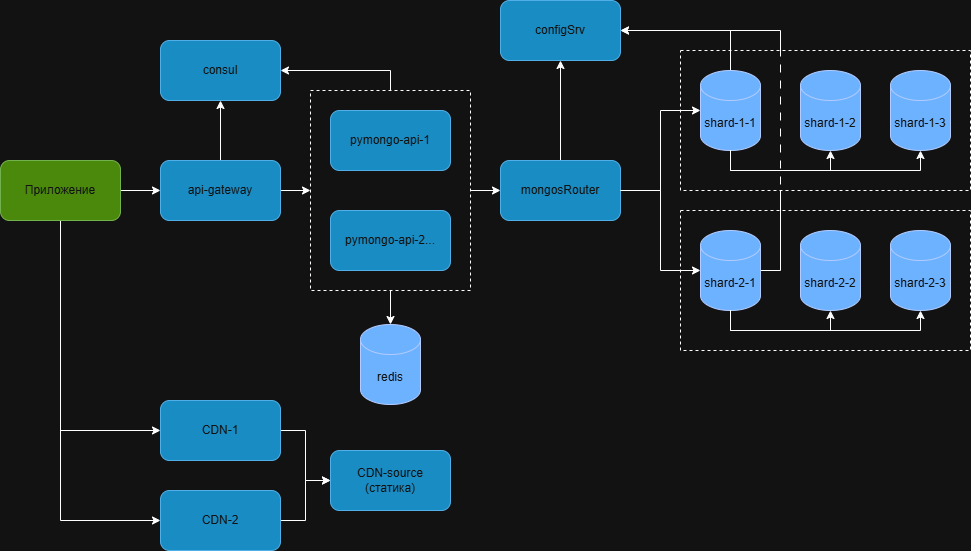

# pymongo-api

## Схема приложения



## Как запустить

### Шаг 1: Выбор корневого пути

Приложение расположено по пути `sharding-repl-cache`

```shell
cd sharding-repl-cache
```

### Шаг 2: Запуск контейнеров

Запускаем MongoDB и приложение:

```shell
docker compose up -d
```

### Шаг 3: Проверка статуса контейнеров

Ожидаем запуск и инициализацию контейнеров. Убедитесь, что контейнер `configSrv` имеет статус **Healthy**:

```shell
docker ps
```

### Шаг 4: Настройка шардирования и репликации

Настраиваем  MongoDB. При ошибках повторите команду через некоторое время:

```shell
./scripts/mongo-setup.sh
```

### Шаг 5: Инициализация данных

Заполняем базу данных:

```shell
./scripts/mongo-init.sh
```

### Шаг 6: Проверка шардов

Проверяем, что данные корректно распределены по шардам:

```shell
./scripts/mongo-verify.sh
```

---

## Как проверить

Откройте приложение в браузере по адресу: **[http://localhost:8080](http://localhost:8080)**

---

## Доступные эндпоинты

Полный список API эндпоинтов и документация доступны по адресу: **[http://localhost:8080/docs](http://localhost:8080/docs)** (Swagger UI)